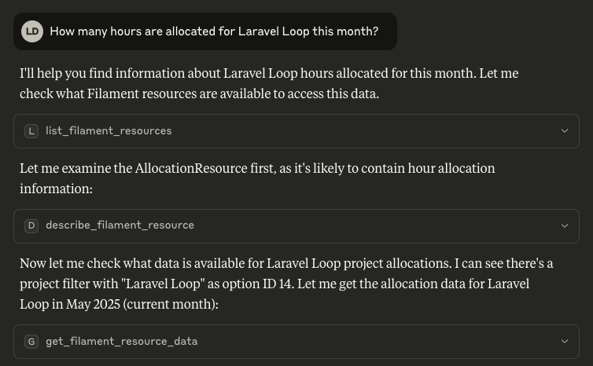

# Filament MCP Server - Laravel Loop



> [!IMPORTANT]
> This is a beta version and is not recommended for production use yet.

The Laravel Loop Filament MCP Server is an extension for [Laravel Loop](https://github.com/kirschbaum-development/laravel-loop) that exposes your Filament Resources as an MCP server. This allows AI assistants and MCP clients to interact with your Filament Resources for data listing, querying, and (optionally) actions.

## What It Does

Exposes your Filament Resources as MCP tools. There are 4 tools available:

- `list_filament_resources`: Lists all available Filament Resources to the MCP client.
- `describe_filament_resource`: Describes the structure, fields, columns, filters, and relationships for a given resource to the MCP client.
- `get_filament_resource_data`: Queries data for a resource, with optional filters.
- `execute_filament_resource_action`: Executes a bulk action on a resource (only in ReadWrite mode).


## Installation

1. Make sure you have Laravel Loop installed and configured.

2. Install the package:

```bash
composer require kirschbaum-development/laravel-loop-filament
```

3. Register the Filament toolkit in your application. This is typically done in a service provider (e.g., AppServiceProvider):

```php
use Kirschbaum\Loop\Loop;
use Kirschbaum\Loop\Filament\FilamentToolkit;

Loop::toolkit(FilamentToolkit::make());
```

By default, it exposes all your Filament resources. You can control which resources are exposed with the `resources` parameter.

```php
use Kirschbaum\Loop\Loop;
use Kirschbaum\Loop\Filament\FilamentToolkit;

Loop::toolkit(FilamentToolkit::make(resources: [
    \App\Filament\Resources\UserResource::class,
    \App\Filament\Resources\PostResource::class,
]));
```

By default, the toolkit is in read-only mode. To expose the bulk actions of your Filament resources, you can register the tool with ReadWrite model.

```php
use Kirschbaum\Loop\Loop;
use Kirschbaum\Loop\Filament\FilamentToolkit;
use Kirschbaum\Loop\Enums\Mode;

Loop::toolkit(
    FilamentToolkit::make(mode: Mode::ReadWrite)
);
```

## Usage

After registering the toolkit, you have to connect Laravel Loop to a MCP client, and the tools will be available.

## Security

If you discover any security related issues, please email security@kirschbaumdevelopment.com instead of using the issue tracker.

## Sponsorship

Development of this package is sponsored by Kirschbaum Development Group, a developer driven company focused on problem solving, team building, and community. Learn more [about us](https://kirschbaumdevelopment.com?utm_source=github) or [join us](https://careers.kirschbaumdevelopment.com?utm_source=github)!

## License

The MIT License (MIT). Please see [License File](LICENSE) for more information.